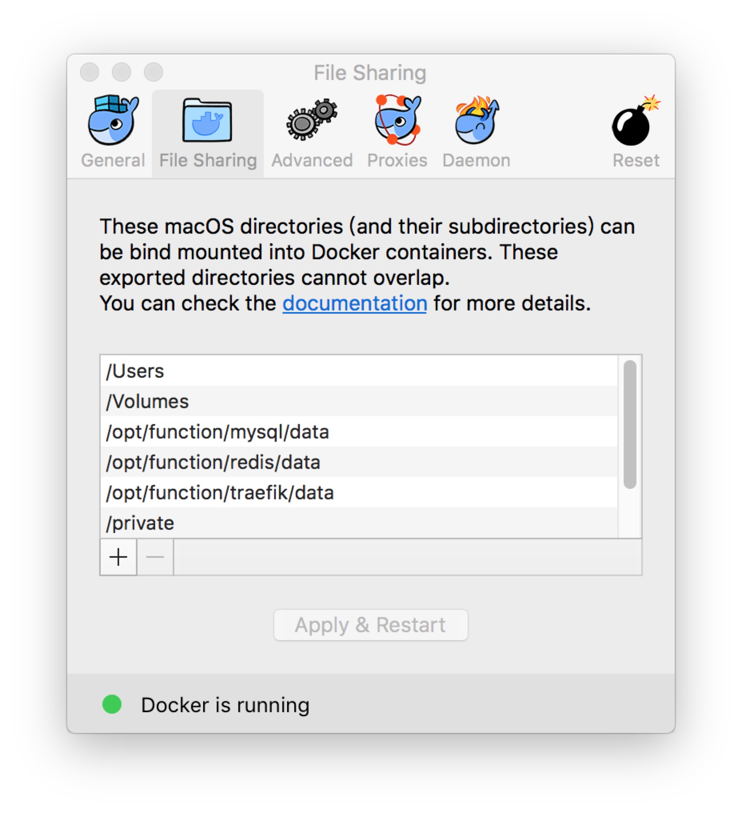

# Mac下安装

MAC环境下可能会出现无法成功部署安装的情况（原因不明确，可能是docker for mac bug，也可能是权限问题）

解决方法：

1. 在Macintosh HD下新建命名为`opt`的文件夹

2. 在上述文件夹内新建命名为`function`的文件夹

3. 在`function`文件夹内新建三个文件夹，分别命名为`mysql`、`redis`、`traefik`

4. 分别在`mysql`、`redis`、`traefik`三个文件夹内新建`data`文件夹

5. 在Docker -> Perfernece... ->File Sharing中，将上述三个`data`文件夹加入列表内

6. 重新通过docker compose部署
